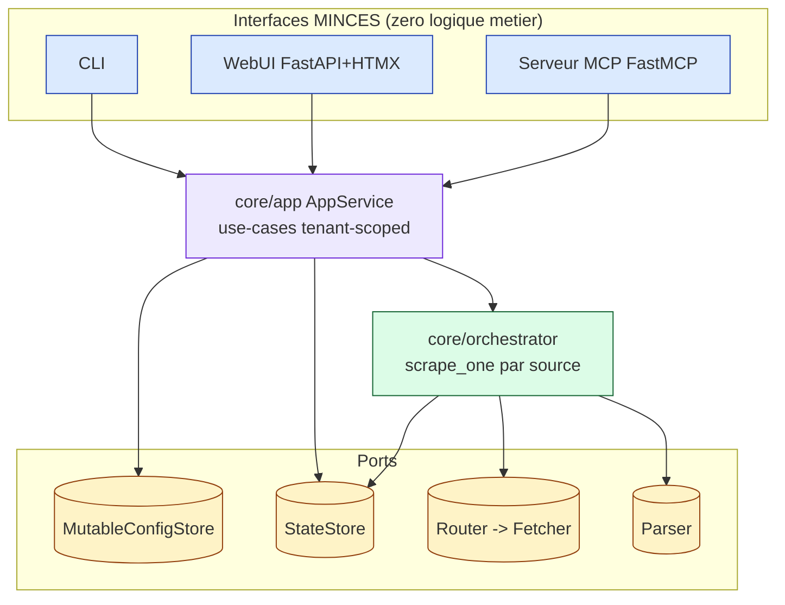
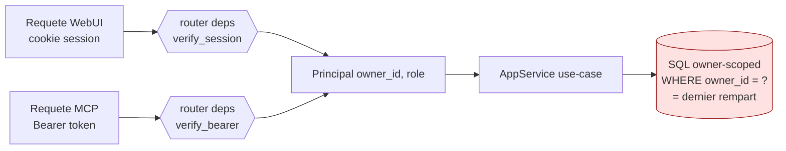
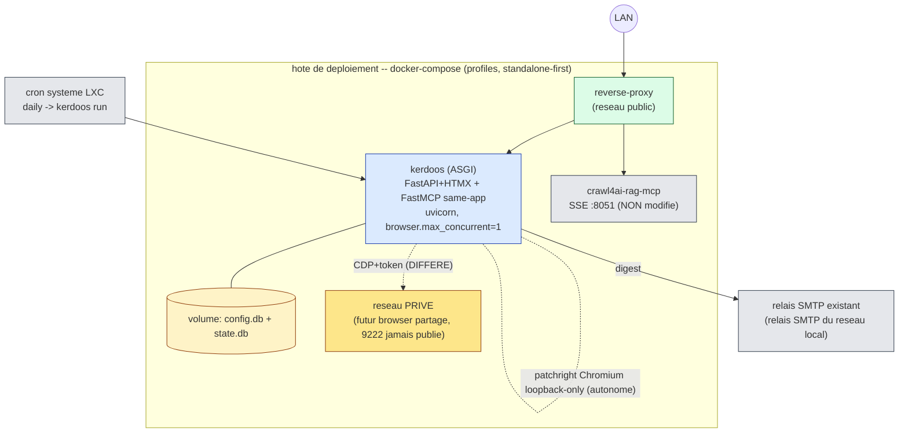

# ADR 0001 -- Plateforme post-MVP : WebUI + MCP minces, config ecrivable, multi-tenant

- **Statut** : ACCEPTED (2026-07-08) -- questions Q1-Q6 tranchees par l'operateur ;
  deux items explicitement DIFFERES (section 13). Prochaine etape : gate
  security-auditor, puis tranche 0.
- **Date** : 2026-07-08
- **Portee** : evolution post-MVP de Kerdoos. Le MVP Mode A (CLI, 6 adaptateurs,
  hexagonal) est acquis et ne doit pas etre casse.
- **Sources de verite** : `CLAUDE.md`, `DESIGN.md` (decisions 1-9), code reel du repo,
  memoires Kleos #11041-11051 (patchright, verdicts Q-i/Q-iv, egress-proxy crawl4ai).

## Changelog

- **2026-07-08 -- PROPOSE -> ACCEPTED**. Arbitrage operateur :
  - Q1 = bootstrap CLI admin (`kerdoos user add [--admin]`) ; role admin WebUI = option post-MVP.
  - Q2 = MCP monte same-app ASGI (principal partage, evite SQLite multi-process).
  - Q3 = **correction de schema** : `sites` devient un CATALOGUE ADMIN-ONLY global
    (plus per-tenant) ; seuls `products`/`sources` portent `owner_id`. Resout la
    tension SSRF T3 : l'allowlist de domaines derive d'un catalogue admin, jamais
    d'une entree utilisateur lambda.
  - Q4 = la DB fait foi une fois editable ; export YAML conserve pour backup/GitOps.
  - Q5 = tier browser reecrit (section 9) : autonome **patchright** (undetected au
    lancement) par defaut ; mode remote CDP DIFFERE ; SSRF via **egress-proxy CONNECT**
    (pattern crawl4ai) en remplacement du pin `--host-resolver-rules` fragile.
  - Q6 = cron systeme pour le daily + file de jobs intra-process pour `run_now`.
  - Tier `uc` INCHANGE (SeleniumBase pour Akamai ; verdict Q-iv : patchright ne bat
    pas Akamai).
- **2026-07-08 -- addendum ACCEPTED (affinages operateur + conditions gate)**.
  Reste ACCEPTED, pas de re-gate complet.
  - Identite **hybride** email OU identifiant (`owners.email` NULLABLE) ; sans email
    -> consultation WebUI seule, pas de digest mail (sections 4, 6).
  - **Tenancy du digest** (finding HIGH du gate) : le run/cron itere PAR owner, un
    digest par owner envoye a `owners.email` ; agregation owner-scopee en SQL.
    L'invariant MVP « digest agrege unique » devient « un digest agrege unique **par
    owner** » (sections 5, 8).
  - **AuthZ bearer token MCP** : `create_token` mint TOUJOURS pour
    `principal.owner_id`, jamais de param owner cible ; `revoke_all(target)` reserve
    admin si `target != self` ; invariant « pas d'usurpation via token admin-minte »
    (section 6).
  - **Conditions gate gravees comme contrat** (section 9) : fix code `ip.ipv4_mapped`
    (bug `safety.py:53-62`, Kleos #11054) ; egress-proxy loopback-only + rejet
    clients non-locaux + ports 80/443 ; `add_site` assert `role=='admin'` DANS le
    service (2e rempart) + param `principal` ; `make_source_id` owner du Principal,
    `product_key` rejette `:` ; `scrapes.owner_id` backfill puis NOT NULL, `record()`
    rejette owner vide.
  - **Nouveau chantier de conception** : pin **`http`** concurrence-safe (section 9.1).

---

## 1. Contexte

Le MVP est complet : coeur-bibliotheque hexagonal, 4 tiers de fetch
(`http -> tls -> browser -> uc`), parsers dedies, `StateStore` SQLite,
`ConfigStore` YAML read-only, CLI. On ajoute **deux interfaces minces** (WebUI +
serveur MCP) sur une **couche use-cases partagee**, on rend la **config
ecrivable** (SQLite), on passe **multi-tenant**, on **package en workspace uv** et
on **extrait `autolycos`**. Deploiement Docker/compose sur LXC Debian.

Ce document tranche 8 sous-decisions (a-h du brief), chacune avec au moins deux
options et une recommandation. Il liste explicitement les tensions avec les
invariants `CLAUDE.md` et les questions a remonter a l'operateur.

### 1.1 Structure reelle actuelle (cartographie, pas l'ideal)

| Couche | Fichier(s) | Role | Dependances |
|---|---|---|---|
| Domaine pur | `core/domain.py` | enums 3-valeurs, `Extract` | aucune (interdit d'importer un outil) |
| Orchestration | `core/orchestrator.py`, `retry.py`, `verdict.py` | `scrape_one` / `scrape_and_record` (par source) | ports uniquement (`autolycos.ports`, `parsers.ports`, `persistence.ports`) |
| Port config | `registry/ports.py` | `ConfigStore.load()->Registry` **read-only**, DTOs frozen, `make_source_id` | `parsers.ports` |
| Adaptateur config | `registry/yaml_store.py` | `YamlConfigStore` + validation URL | `autolycos.safety` |
| Port etat | `persistence/ports.py` | `StateStore.record()` / `history(source_id, limit)` | `core.domain` |
| Adaptateur etat | `persistence/sqlite_store.py` | table unique `scrapes`, migration `user_version` | stdlib |
| Anti-bot | `autolycos/*` | `Fetcher`, `StaticRouter`, `safety`, adapters | **zero import de `core`** (verifie) |
| Interface | `interfaces/cli/main.py` | composition root + boucle `run` | tout le reste |

**Constat structurant** : il n'existe **aucune couche use-cases**. La logique de
`run` (iterer les sources, resoudre `tier2_labels`, filet fail-closed par source,
rendre le digest) vit dans `interfaces/cli/main.py::cmd_run`. C'est une **entorse
latente a l'invariant #9** (interface mince). Elle est benigne avec une seule
interface, mais devient une **duplication de logique metier** des qu'on ajoute
WebUI + MCP. La couche use-cases n'est donc pas un luxe : c'est le prealable qui
rend les trois interfaces reellement minces.

---

## 2. Invariants a respecter (rappel operatoire)

1. Aucun outil ne fuit dans `core/`.
2. `autolycos/` n'importe jamais `core/`.
3. Etat a 3 valeurs `{ok, indetermine, indisponible}`.
6. Escalade fetcher `http -> tls -> browser -> uc`.
7. Config et etat separes, chacun derriere une abstraction.
9. Interfaces MINCES, zero logique metier.

Toute decision ci-dessous est evaluee contre ces invariants ; les tensions sont
regroupees en section 12.

---

## 3. (a) Layering : couche use-cases partagee

### Probleme
Ou placer `add_product`, `remove_source`, `add_site`, `list_state`,
`get_history`, `run_now` pour que CLI, WebUI et MCP soient trois vues minces sur
le meme comportement, sans logique metier dans les interfaces ?

### Options
- **Option A -- `core/app/` (services applicatifs dans `core`)**. Une couche
  `core/app/services.py` qui prend les ports (`ConfigStore` mutable, `StateStore`,
  `Router`, orchestrateur) par injection et expose les use-cases. L'orchestrateur
  actuel (`scrape_one`) reste un collaborateur bas-niveau appele par `run_now`.
  *Cout* faible (deplacement de logique existante). *Risque* faible. *Reversibilite*
  haute. Conforme au brief (« couche use-cases dans core »).
- **Option B -- package top-level `application/`**. Separer physiquement
  l'orchestration par-scrape (`core/`) des services CRUD + `run_now`
  (`application/`). *Cout* moyen (nouveau package, nouveaux imports). *Benefice*
  frontiere plus visible. *Risque* : contredit la formulation « dans core » et
  ajoute une couche pour une app de taille modeste.

### Recommandation : **Option A**
Force decisive : le brief verrouille « couche use-cases partagee **dans core** »,
et la logique a deplacer existe deja (elle vient du CLI). On cree
`core/app/` (use-cases orientes intention) qui **oriente** l'orchestrateur
existant ; `core/` continue de n'importer que des **ports**, donc l'invariant #1
tient. Chaque use-case est une fonction/methode pure d'orchestration prenant ses
dependances en parametres (pas de singleton global, pas d'import d'adaptateur).

### Contrat de la couche application (signatures cibles, indicatives)

```python
# core/app/services.py  -- imports: ports only (config, state, router, orchestrator)
# Toute methode est TENANT-SCOPEE: le principal resolu est passe explicitement.

class AppService:
    def __init__(self, config: MutableConfigStore, state: StateStore,
                 router: Router, clock: Clock) -> None: ...

    # --- lecture ---
    def list_state(self, owner: OwnerId) -> list[SourceState]: ...      # dernier etat par source
    def get_history(self, owner: OwnerId, source_id: str,
                    limit: int = 50) -> list[ScrapeRecord]: ...
    def list_config(self, owner: OwnerId) -> Registry: ...             # sites + produits du tenant

    # --- ecriture config ---
    def add_site(self, owner: OwnerId, spec: SiteSpec) -> SiteConfig: ...
    def add_product(self, owner: OwnerId, spec: ProductSpec) -> Product: ...
    def add_source(self, owner: OwnerId, product_id: str, site: str,
                   url: str) -> ProductSource: ...
    def remove_source(self, owner: OwnerId, source_id: str) -> None: ...

    # --- action ---
    def run_now(self, owner: OwnerId, *, source_id: str | None = None) -> RunHandle: ...
```

Regles :
- **`run_now` est non bloquant** : les tiers `browser`/`uc` sont lents (render +
  networkidle). Il enqueue un job et retourne un `RunHandle` ; l'interface poll
  l'etat via `list_state`/`get_history`. Le mecanisme de job est lie a la decision
  scheduler (section 8, question ouverte Q6).
- Les interfaces (CLI/WebUI/MCP) ne font que : (1) resoudre le principal,
  (2) valider/mapper l'entree, (3) appeler un use-case, (4) presenter. Aucune
  boucle metier, aucune resolution de `tier2_label`, aucun wiring d'adaptateur
  hors composition root.
- La **composition root** unique par interface construit les adaptateurs concrets
  et injecte `AppService`. Le CLI actuel migre : `cmd_run` devient un appel a
  `run_now` + presentation du digest.



---

## 4. (b) ConfigStore ecrivable : port + schema + tenancy + migration YAML

### Probleme
`ConfigStore` est aujourd'hui `load() -> Registry` (read-only, snapshot immuable).
Il faut des mutations (ajout site/produit/source, suppression source), un backing
SQLite, et une colonne de tenancy partout. `YamlConfigStore` devient un
importeur/seed.

### Options
- **Option A -- etendre le meme port** avec des methodes d'ecriture. Un seul
  `ConfigStore` gonfle (load + add_* + remove_*). *Cout* faible. *Risque* :
  l'orchestrateur (qui n'a besoin que de lire) depend d'un port porteur d'ecriture
  -- violation d'ISP, surface d'erreur plus large.
- **Option B -- segregation lecture/ecriture (ISP)**. `ConfigStore` garde
  `load(owner)` (lecture) ; un `MutableConfigStore(ConfigStore)` ajoute les
  ecritures. L'orchestrateur/`run_now` ne recoit que le contrat de lecture ; seules
  la WebUI/MCP recoivent le contrat mutable. *Cout* leger (un Protocol de plus).
  *Benefice* : le coeur ne peut pas muter la config par accident ; testabilite.

### Recommandation : **Option B (segregation)**
Force decisive : discipline de moindre autorite. Le port de lecture reste le
contrat que le coeur consomme (invariant #7 : le coeur charge la config via une
abstraction) ; l'ecriture est un sur-contrat reserve aux interfaces. Un seul
adaptateur `SqliteConfigStore` implemente les deux.

```python
# registry/ports.py
class ConfigStore(Protocol):                 # lecture (consomme par le coeur)
    def load(self, owner: OwnerId) -> Registry: ...

class MutableConfigStore(ConfigStore, Protocol):   # +ecriture (interfaces seules)
    def add_site(self, owner: OwnerId, site: SiteConfig) -> None: ...
    def add_product(self, owner: OwnerId, product: Product) -> None: ...
    def add_source(self, owner: OwnerId, source: ProductSource) -> None: ...
    def remove_source(self, owner: OwnerId, source_id: str) -> None: ...
```

### Schema SQLite config (base **distincte** de l'etat -- invariant #7)

> **Q3 (correction de schema, verrouille operateur)** : les `sites` NE sont PAS
> per-tenant. C'est un **catalogue admin-only global**. Ajouter un site (= un
> nouveau domaine) est un **point de controle admin**, jamais une ecriture d'un
> utilisateur lambda. Seuls `products` et `sources` portent `owner_id` (per-tenant).
> Consequence SSRF majeure : l'allowlist de domaines derive du **catalogue admin**,
> pas d'une entree utilisateur -> la tension T3 se resout structurellement (un
> utilisateur ne peut pas etendre l'allowlist).
>
> Note table `sources` : le MVP avait **deliberement** choisi de NE PAS persister
> de table `sources` cote ETAT (`make_source_id` folde l'url en sha256, l'url n'est
> jamais persistee ; DESIGN #2, Kleos #10862). Cette decision reste vraie cote etat
> (`scrapes` mono-table). Cote **config**, une config editable DOIT persister
> sites/produits/sources. Pas de contradiction : la table `sources` nait dans la
> base config, pas dans la base etat.

```sql
-- config.db (mutable, source de verite une fois seed depuis YAML -- Q4)
CREATE TABLE owners (
    id            TEXT PRIMARY KEY,          -- uuid
    name          TEXT NOT NULL UNIQUE,      -- identifiant de login (email OU handle)
    email         TEXT,                      -- NULLABLE (identite hybride, cf. infra)
    password_hash TEXT,                      -- Argon2id; NULL = pas de login pw
    role          TEXT NOT NULL DEFAULT 'user',   -- 'user' | 'admin'
    state         TEXT NOT NULL DEFAULT 'active', -- 'active' | 'disabled'
    created_at    TEXT NOT NULL
);
-- Identite HYBRIDE : un compte se cree par email OU par identifiant. Si cree par
-- identifiant, l'email est optionnelle et ajoutable au profil plus tard.
-- owners.email NULL -> l'owner ne recoit PAS de digest mail (consultation WebUI
-- uniquement) ; il n'est JAMAIS agrege dans le mail d'un autre owner (section 5).

-- CATALOGUE ADMIN-ONLY : global, PAS d'owner_id. Ajout = operation admin
-- (role='admin'), point de controle de l'allowlist de domaines (SSRF).
CREATE TABLE sites (
    name          TEXT PRIMARY KEY,
    fetcher       TEXT NOT NULL,             -- http|tls|browser|uc
    parser_kind   TEXT NOT NULL,
    parser_pix    TEXT, parser_card TEXT, parser_availability TEXT,
    tier2_label   TEXT,
    subresource_domains TEXT,                -- JSON array de hosts
    domain        TEXT NOT NULL              -- domaine enregistrable (allowlist scope)
);

-- PER-TENANT : products/sources portent owner_id.
CREATE TABLE products (
    owner_id      TEXT NOT NULL REFERENCES owners(id),
    product_key   TEXT NOT NULL,             -- id authored par l'user (ex: aw3225qf)
    name          TEXT,
    PRIMARY KEY (owner_id, product_key)
);

CREATE TABLE sources (
    source_id     TEXT PRIMARY KEY,          -- derive: owner:product:site:sha256(url)[:12]
    owner_id      TEXT NOT NULL REFERENCES owners(id),
    product_key   TEXT NOT NULL,
    site          TEXT NOT NULL REFERENCES sites(name),   -- reference le catalogue global
    url           TEXT NOT NULL,
    FOREIGN KEY (owner_id, product_key) REFERENCES products(owner_id, product_key),
    UNIQUE (owner_id, product_key, site, url)   -- dedup triple (remplace le guard YAML)
);
```

Points de conception :
- **`site` reference le catalogue global** (`sites.name`), pas une entree
  per-tenant. `add_source(owner, product, site, url)` **rejette** un `site` absent
  du catalogue : un utilisateur ne peut cibler que des sites deja valides par un
  admin. C'est le coeur de la resolution SSRF (section 9).
- **`add_site` est un use-case reserve `role='admin'`** : nouvelle dimension
  d'autorisation en plus du scoping tenant. Le router MCP/WebUI qui l'expose porte
  un guard de role (au-dela de `verify_*`). Voir tension T6 (section 12).
- **`load(owner)` compose** le catalogue global `sites` avec les `products`/`sources`
  du tenant -> `Registry`. Un tenant voit tous les sites du catalogue (config de
  fetch, non sensible) mais n'ajoute des produits que sur ces sites.
- **`source_id` inclut l'owner** :
  `make_source_id(owner, product_key, site, url) = f"{owner}:{product_key}:{site}:{sha256(url)[:12]}"`.
  Sans owner, deux tenants au meme `product_key` collisionneraient sur la meme cle
  d'historique. Seule modif de `registry/ports.py::make_source_id` (signature elargie).
  **Contrat gate** : l'`owner` vient TOUJOURS du `Principal` resolu (section 6),
  **jamais** d'un champ du body de la requete ; et `product_key` est **valide pour
  rejeter le separateur `:`** (sinon un `product_key` malicieux pourrait fabriquer
  un `source_id` collisionnant avec un autre tenant / une autre source).
- **Migration YAML -> SQLite** : `YamlConfigStore` n'est plus consomme au runtime.
  `kerdoos config import config/` seed le **catalogue sites** (global) ;
  `kerdoos config import --owner <id> config/` seed les **produits** d'un tenant.
  Parseur existant (deja durci `safe_load` + validation), INSERT idempotent (UPSERT).
  Q4 : la DB fait foi une fois editable ; un `kerdoos config export` regenere un YAML
  pour backup/GitOps.
- La validation d'URL migre du chargement YAML vers **une fonction partagee unique**
  (exigence SSRF #4, section 9) appelee par `add_source` ET le fetcher.

---

## 5. (c) StateStore : lister l'etat multi-source par owner

### Probleme
`StateStore` n'expose que `history(source_id, limit)`. La WebUI/MCP ont besoin de
« l'etat courant de toutes mes sources » (dernier scrape par source, scope tenant)
et d'un historique tenant-scope.

### Options
- **Option A -- calcul cote application** : appeler `history(source_id, 1)` en
  boucle sur les sources du tenant. *Cout* nul en schema. *Risque* : N requetes,
  N+1 classique, lent des que le parc grandit ; pas de scoping owner natif.
- **Option B -- etendre le port avec des lectures scoped**. Ajouter
  `latest_all(owner)` (dernier row par source du tenant, une requete) et rendre
  `history` owner-scope. *Cout* : deux methodes + une requete fenetree. *Benefice* :
  une requete, scoping owner au niveau SQL (dernier rempart), pas de N+1.

### Recommandation : **Option B**
Force decisive : le scoping tenant doit vivre **dans la requete** (projection
tenant-scoped = dernier rempart, cf. rule FastAPI multi-tenant). Un calcul cote
app qui oublie le filtre owner fuit ; une requete SQL owner-scoped ne le peut pas.

```python
# persistence/ports.py
class StateStore(Protocol):
    def record(self, owner: OwnerId, scrape: ScrapeRecord) -> None: ...
    def history(self, owner: OwnerId, source_id: str, limit: int = 50) -> list[ScrapeRecord]: ...
    def latest_all(self, owner: OwnerId) -> list[ScrapeRecord]: ...   # dernier par source
```

Schema etat (evolution additive, `user_version 3`) :
```sql
ALTER TABLE scrapes ADD COLUMN owner_id TEXT;   -- additif, idempotent (pattern existant)
CREATE INDEX idx_scrapes_owner_source_ts ON scrapes (owner_id, source_id, ts DESC);
```
`latest_all` = fenetre `ROW_NUMBER() OVER (PARTITION BY source_id ORDER BY ts DESC)`
filtree `owner_id = ?` (SQLite >= 3.25 supporte les window functions ; Debian
bookworm ships 3.40). Toutes les lectures/ecritures filtrent `owner_id = ?` inline
-- jamais de filtre applicatif seul.

**Contrat gate `scrapes.owner_id`** : la colonne est ajoutee NULLABLE (additif),
**backfillee** pour les lignes MVP existantes (owner du bootstrap), puis contrainte
**NOT NULL** ; `record(owner, scrape)` **rejette un owner vide/None** (fail-closed :
une ligne d'etat sans proprietaire est un defaut d'isolation, pas une donnee).

### Tenancy du digest (resout le finding HIGH du gate)
L'invariant MVP « **digest agrege unique** » (DESIGN #8) devient « **un digest
agrege unique PAR owner** ». Le run (cron daily et `run_now`) **itere par owner** :
- pour chaque owner, on scrape ses sources, on agrege **owner-scope en SQL**
  (`latest_all(owner)`), on rend UN digest et on l'envoie a `owners.email`.
- **`owners.email IS NULL` -> aucun mail** : l'owner consulte son etat en WebUI ; il
  n'est **jamais agrege dans le mail d'un autre owner**. C'est le coeur du fix HIGH :
  aucune fuite d'un produit/prix d'un tenant vers le digest d'un autre.
- L'agregation ne melange jamais deux owners : la requete est filtree `owner_id = ?`,
  et la resolution de l'adresse destinataire vient du meme owner (pas d'adresse
  globale). Rappel discipline (rule FastAPI multi-tenant) : ne jamais deriver le
  contenu d'un primary global ; projeter l'occurrence du proprietaire.

> **Rappel discipline (rule FastAPI)** : deriver l'affichage de l'occurrence du
> **requeteur**, jamais d'un primary global ; ne jamais serialiser le champ de
> tenancy (`owner_id`) dans le modele de sortie ; dropper l'enregistrement si 0
> occurrence owner-propre. Ici les scrapes ne sont pas dedupliques cross-tenant
> (owner dans la cle), donc le risque est moindre, mais la regle « ne pas exposer
> `owner_id` en sortie » et « filtrer owner en SQL » s'applique quand meme.

### 5.1 Discipline de connexion SQLite sous ASGI concurrent (Phase 3, decision 2026-07-09)

Les stores actuels (`SqliteConfigStore`, `SqliteStateStore`) tiennent une
**connexion unique `self._conn`** (`check_same_thread=True` par defaut). Sous
handlers ASGI multi-thread (Phase 4/5) cela leve `sqlite3.ProgrammingError`. Le
critere Phase 3 exige « concurrent multi-thread SANS ProgrammingError NI
head-of-line lock », ce qui **disqualifie** `check_same_thread=False` + verrou
global (head-of-line).

**Decision (Option 2, verdict architect) : connexion PAR OPERATION pour le seul
chemin reellement concurrent (auth), migration des stores config/state
DIFFEREE a la tranche ASGI (Phase 4/5) ou ils sont exposes.** Le plus petit
changement qui resout la force ; les stores config/state restent CLI-only
(mono-thread) en Phase 3.

- **Invariant porteur** : `owners` vit dans config.db derriere le `self._conn`
  unique de `SqliteConfigStore`. Le chemin `verify_session`/`verify_bearer` lit
  `owners` (state='active', role, password_hash). Donc **tout le chemin verify_*
  (y compris le SELECT owners) DOIT passer par des connexions PER-OP de
  l'auth-store, JAMAIS par le `self._conn` de `SqliteConfigStore`** -- sinon la
  concurrence retape la connexion partagee (ProgrammingError). L'ecriture CLI
  (`ensure_owner`) peut rester single-conn (mono-thread) ; seul le chemin
  concurrent est per-op.
- **WAL** : l'auth-store passe en `PRAGMA journal_mode=WAL` -> lecteurs
  concurrents non bloques par une ecriture de login, pas de « database is
  locked », satisfait litteralement « ni head-of-line lock » au niveau SQLite.
- **`:memory:` en test** : fichiers temp (`tmp_path`), PAS de branche
  `:memory:`-persistante dans le code de prod (elle reintroduirait
  `check_same_thread=False`). La logique de connexion reste UNIFORME (toujours
  per-op). Un helper de TEST etroitement scope si une assertion in-memory est
  vraiment requise.
- **FD3 (prerequis DUR de Phase 4/5)** : avant que WebUI/MCP exposent
  `SqliteConfigStore` + `SqliteStateStore` sous handlers concurrents, ces deux
  stores migrent en per-op (+ `_migrate` idempotent-par-connexion + meme
  strategie `:memory:`). Migration COUPLEE a l'exposition = le bon seam.
- **Direction cible** : l'identite (owners + sessions + tokens) converge vers un
  contexte borne per-op a part entiere en Phase 4/5.

---

## 6. (d) Modele d'identite / auth : principal unique, session vs bearer

### Probleme
WebUI (login/mot de passe, sessions) et MCP (bearer token) doivent resoudre le
**meme principal**. Ou appliquer l'isolation tenant, une seule fois, sans faille
d'enumeration ?

### Options
- **Option A -- auth par endpoint** (`Depends(require_auth)` sur chaque route).
  *Rejete* : un oubli sur une seule route ouvre un acces anonyme silencieux (rule
  FastAPI « auth au niveau router »). Anti-pattern connu.
- **Option B -- auth au niveau router + resolution de principal centralisee +
  scoping tenant en projection (dernier rempart)**. Deux resolveurs de credential
  (`verify_session`, `verify_bearer`) convergent vers un `Principal(owner_id, role)`
  unique ; les routers proteges portent la dependency ; toutes les requetes data
  sont owner-scoped au niveau repository.

### Recommandation : **Option B**
Force decisive : defense en profondeur avec un point d'application unique.
L'isolation ne repose pas sur la memoire du developpeur (oubli de `Depends`) mais
sur (1) la dependency **de router**, (2) la **projection owner-scoped** en SQL
comme dernier rempart.

Modele :
- **`Principal`** = `(owner_id, role)`. Un seul type, quelle que soit la source du
  credential.
- **WebUI** : login mot de passe -> cookie de session signe (ou table `sessions`).
  `verify_session` joint `owners` et filtre `state='active'` **inline**.
- **MCP** : `Authorization: Bearer <token>`. Table `credentials(owner_id,
  token_hash, expires_at, state)`. `verify_bearer` joint `owners` et filtre
  `owners.state='active'` **inline** (un compte desactive coupe l'acces meme si le
  token n'est pas encore expire -- rule FastAPI « verify_* doit refleter
  state='active' »).
- **Point d'application unique** : deux `APIRouter(dependencies=[...])` (un
  `verify_session`, un `verify_bearer`) exposent chacun les use-cases via le meme
  `AppService`, en injectant le `Principal.owner_id`. Aucun use-case n'est
  atteignable sans principal resolu.
- **Anti-enumeration login** : les TROIS chemins d'echec (nom inconnu / mauvais mot
  de passe / compte sans mot de passe `password_hash IS NULL`) paient EXACTEMENT un
  cout de hash Argon2id (dummy verify), reponse (status + detail) et latence
  uniformes (rule FastAPI « login anti-enumeration »).

### Identite hybride (email OU identifiant)
Un compte se cree **par email OU par identifiant** (les deux supportes). Cree par
identifiant : l'email est **optionnelle** (`owners.email` NULLABLE), ajoutable au
profil ensuite. `owners.name` = l'identifiant de login (une adresse email OU un
handle). Consequence produit : un owner **sans email** n'a pas de canal digest ->
consultation WebUI uniquement (section 5).

### AuthZ des bearer tokens MCP (invariant anti-usurpation)
Les tokens sont **lies a l'utilisateur** :
- **`create_token(principal)` mint TOUJOURS pour `principal.owner_id`**, il n'existe
  **aucun** parametre « owner cible ». Un admin cree un token **pour lui-meme
  seulement**, jamais pour autrui. C'est l'invariant : **pas d'usurpation via un
  token admin-minte**.
- **`revoke_all(target)`** (revocation en masse tokens + sessions + connexions) est
  **reserve admin** quand `target != self` ; tout owner peut se revoquer lui-meme.
  Un admin **revoque** n'importe quel compte mais ne **cree** jamais d'acces pour un
  tiers -> asymetrie voulue (un admin peut couper, pas se faire passer pour).
- **`state='disabled'` coupe l'acces** : `verify_session`/`verify_bearer` filtrent
  `owners.state='active'` **inline** (un compte desactive est coupe meme si le token
  n'est pas expire -- rule FastAPI). `revoke_all` + `state='disabled'` = deux leviers
  complementaires (revoquer les credentials vs desactiver le compte).



### Creation d'utilisateur (Q1, tranche)
**Decision operateur : bootstrap CLI admin.** `kerdoos user add --name <n> [--admin]`
cree les comptes hors HTTP (pas de surface d'auto-inscription), aligne « admin par
la ligne de commande sur le LXC ». Le premier compte cree avec `--admin` est aussi
l'admin du **catalogue sites** (Q3 : `add_site` reserve `role='admin'`). Le **role
admin dans la WebUI** (gestion des comptes via l'UI) reste une **option post-MVP**,
non implementee day one. L'auto-inscription publique est ecartee (service LAN prive).

---

## 7. (e) Layout workspace uv + extraction d'autolycos

### Probleme
Packager en workspace uv (monorepo) et extraire `autolycos` en package autonome
maintenant. Contrainte : `autolycos` ne doit importer ni `core` ni les autres
packages Kerdoos (verifie : aujourd'hui zero import).

### Options
- **Option A -- uv workspace, deux membres** : `autolycos` (lib generique
  anti-bot) + `kerdoos` (app : core, registry, persistence, parsers, digest,
  interfaces). `kerdoos` depend de `autolycos` via le workspace. *Cout* moyen
  (restructuration packaging). *Benefice* : frontiere d'API reelle (le port
  `Fetcher`), extraction future en repo autonome sans refactor, versionnage
  independant.
- **Option B -- single package, autolycos en sous-module** : garder le layout
  actuel, juste ajouter un `pyproject.toml`. *Cout* faible. *Risque* : ne realise
  pas l'extraction demandee ; la frontiere reste conventionnelle, pas contractuelle.

### Recommandation : **Option A**
Force decisive : le brief acte l'extraction **maintenant**, et le prealable
(zero import de `core`) est deja satisfait. Le workspace uv fige la frontiere au
niveau packaging (dependance a sens unique `kerdoos -> autolycos`), ce que le code
respecte deja.

Layout cible :
```
kerdoos/                      (workspace root)
├── pyproject.toml            [tool.uv.workspace] members = ["packages/*"]
├── packages/
│   ├── autolycos/            package autonome (PyPI-ready plus tard)
│   │   ├── pyproject.toml    name="autolycos"; extras: [browser], [tls], [uc]
│   │   └── src/autolycos/    ports, router, safety, detect(futur), adapters/
│   └── kerdoos/              application
│       ├── pyproject.toml    depends on "autolycos"; extras: [web], [mcp]
│       └── src/kerdoos/      core/, registry/, persistence/, parsers/, digest/,
│                             interfaces/{cli,web,mcp}/
```

Points cle :
- **`ALLOWED_DOMAINS` ne peut pas rester hardcodee dans `autolycos`** si la lib se
  veut generique. Elle devient une **politique injectee** : `autolycos.safety`
  expose `ip_is_safe` (garde SSRF dure, non negociable) et un `DomainPolicy`
  fourni par l'appelant (Kerdoos passe l'allowlist derivee des sites configures --
  cf. section 9 et 11). C'est la seule modif de contrat imposee par l'extraction.
- **Dependances optionnelles par extra** : `curl_cffi` (tls) ; `[browser]` =
  **`patchright>=1.49`** (fork undetected de Playwright : patch `Runtime.enable`,
  flags, binaire Chromium patche au lancement) **+ `playwright-stealth>=2.0`**
  (optionnel) -- c'est un **upgrade du tier browser** actuel (`playwright ->
  patchright`, Kleos #11046) ; `seleniumbase` (uc, inchange -- verdict Q-iv #11051).
  Deja importees en lazy dans le code -> les extras refletent le lazy-import existant
  et permettent l'image Docker slim (section 8).
- Layout `src/` : declarer explicitement le package (rule Python `src/` layout).
- `requires-python = ">=3.11"` (le code utilise `datetime.timezone.utc` ; 3.11
  aligne `datetime.UTC` et les window functions restent cote SQLite).

---

## 8. (f) Topologie Docker / compose

### Probleme
Servir WebUI + MCP sur le LAN depuis un LXC Debian, DB en volume, avec un tier
browser configurable (autonome vs distant, section 9). Contrainte connue :
mini-PC ~25 GiB, historique OOM (baisser la concurrence, images maitrisees).

### Options
- **Option A -- un service applicatif + navigateurs bundles (image lourde)**.
  Une image Kerdoos embarquant Playwright/Chromium (+ SeleniumBase pour uc). DB
  SQLite (config.db + state.db) sur volume. *Cout* : image lourde (~1-2 GiB). *Benefice* :
  autonome, aucune dependance externe, defaut demande.
- **Option B -- image slim remote-only** : Kerdoos sans navigateur, le tier browser
  se connecte a un Chromium distant (LXC crawl4ai) via CDP. *Cout* : dependance a un
  service frere. *Benefice* : image legere, RAM du navigateur deportee hors du LXC
  Kerdoos (pertinent vu l'historique OOM).

### Recommandation : **supporter les DEUX, defaut Option A (autonome)**
Force decisive : l'operateur impose de supporter les deux, defaut autonome. On publie
**deux tags d'image** depuis le meme Dockerfile multi-stage : `kerdoos:autonomous`
(bundle **navigateurs patchright**, cf. section 7 : l'image installe les navigateurs
patchright) et `kerdoos:slim` (remote-only). L'image slim n'embarque pas les binaires,
donc `browser.mode=autonomous` sur l'image slim echoue proprement (fail-closed a la
construction du fetcher).

### Topologie (Q6 + separation reseau, verrouille)
- **Un seul `docker-compose` sur l'hote de deploiement**, avec des **profiles**
  pour rendre chaque service demarrable seul (**standalone-first**). Le MCP est
  monte **same-app** (Q2) -> un seul process ASGI sert WebUI + MCP.
- **`crawl4ai-rag-mcp` N'EST PAS modifie** (reste Chromium in-process, SSE port 8051,
  `mem_limit=2GiB` swap 0 ; Kleos #11048). Kerdoos co-habite sans le toucher.
- **Separation reseau** : reseau **public/reverse-proxy** pour les endpoints
  legitimes (UI/API Kerdoos, SSE crawl4ai) ; reseau **prive** pour un futur browser
  partage. **Jamais** de mapping `ports:` sur `9222` (CDP), sur aucun des deux
  reseaux (Kleos #11047).
- **OOM-aware** : RAM du LXC non figee mais `browser.max_concurrent=1` (un seul
  render a la fois) ; Chromium est le principal consommateur RAM.
- **Ordonnancement (Q6)** : **cron systeme** du LXC appelant `kerdoos run` pour le
  digest quotidien (modele MVP, robuste) **+ file de jobs intra-process** pour
  `run_now` declenche par UI/MCP (non bloquant, section 3).
  > **DEVIATION RATIFIEE (2026-07-10, [ADR 0002](./0002-productionisation.md) Decision 1)** :
  > le digest quotidien passe d'un **cron systeme externe** a un **timer asyncio
  > intra-process** (option S-B) qui enfile le digest dans la MEME file que
  > `run_now`. Force decisive : coherence OOM (une seule porte browser inter+intra
  > process ; `max_concurrent=1` ne garde que l'intra-process). Defaut a
  > `workers=1` ; si `workers>1`, l'app ne demarre PAS le scheduler et invite a un
  > cron externe + `kerdoos digest`. La file intra-process pour `run_now` reste
  > inchangee. ADR 0002 est desormais la reference pour l'ordonnancement.
- SMTP : hote/port/auth **lus de la config**, jamais codes en dur (CLAUDE.md).



---

## 9. (g) Browser autonome patchright + SSRF egress-proxy (Q5, reecrit)

> **Sequencage (gate Phase 0, 2026-07-08)** : la **Phase 0 conserve `playwright`**
> (extra `[browser]=playwright`, import `playwright.sync_api`) -- plus honnete qu'un
> extra `patchright` non encore utilise. Le **swap `playwright -> patchright` +
> `playwright-stealth`** atterrit en **Phase 2**, avec l'egress-proxy CONNECT (meme
> tranche behavioral). La cible ci-dessous decrit l'etat post-Phase-2.

### Decision (Q5, verrouille operateur)
- **Defaut = mode `autonomous`** : Kerdoos lance **son propre** Chromium via
  **patchright** (pas le playwright standard) -> undetected **au lancement** (patch
  `Runtime.enable`, flags, binaire patche), + `playwright-stealth` optionnel.
  **Loopback-only, zero CDP publie.** C'est un **upgrade** du tier browser actuel
  (Kleos #11046, #11049).
- **Mode `remote` = opt-in, DIFFERE, NON active day one** : connexion CDP-over-WS
  avec `?token=` vers un service **browserless+TOKEN** sur un **reseau Docker prive** ;
  `9222` JAMAIS publie sur le LAN (Kleos #11047). **On construit la capacite de
  config (`cdp_url` + `token`) mais on ne l'active pas.**
- **Tier `uc` : toujours local, inchange** (SeleniumBase pour Akamai/Magalu). Verdict
  Q-iv (Kleos #11051, conf 60% vers NON) : aucune preuve que patchright batte Akamai
  -> **pas de consolidation `uc -> patchright`**.

### Verdict Q-i sur le stealth en mode remote (Kleos #11050, conf 65%)
En `connect_over_cdp`, seul le stealth **CDP-level** (evitement `Runtime.enable`) est
preserve ; le stealth de **LANCEMENT** est **PERDU** (c'est browserless qui lance le
Chromium, pas patchright). **Stealth degrade** -> le mode remote est **reserve aux
fetches NON hostiles**. C'est un facteur decisif du report du mode remote.

### SSRF : pattern egress-proxy CONNECT (remplace le pin --host-resolver-rules)
Le pin anti-rebind `--host-resolver-rules=MAP <host> <ip>` (`browser.py`) est un
**flag de lancement** fragile : ordre des regles load-bearing, bugs Magalu
(Kleos #11001, #10996). On **adopte le pattern egress-proxy CONNECT de crawl4ai**
(Kleos #11042) dans `autolycos.safety`, en remplacement/complement :

- Un **proxy HTTP CONNECT local** (127.0.0.1, loopback) devant lequel Chromium est
  lance (`--proxy-server=127.0.0.1:<port>`). **Chromium ne resout jamais la cible
  lui-meme** : il delegue au proxy via CONNECT.
- Le proxy applique `resolve_and_pin` : il resout le hostname UNE fois, valide via
  `ip_is_safe`, et **ouvre la connexion sortante sur l'IP pinnee** -- fermeture de
  la fenetre TOCTOU DNS-rebind au niveau reseau, sans dependre d'un flag de
  lancement Chromium.
- Le proxy **strippe les args Chromium dangereux** fournis par l'appelant
  (`--host-resolver-rules` et consorts, `_DANGEROUS_BROWSER_ARGS`) pour empecher un
  contournement.
- **Durcissement du proxy (contrat gate)** : il **bind loopback-only** (`127.0.0.1`),
  **rejette tout client non-local** (aucune ecoute exposee au reseau), et
  **restreint les ports cible a 80/443** (pas de CONNECT vers un port arbitraire).
- Ce pattern s'applique aux tiers **Chromium lances localement** (`browser`
  autonome ET `uc`), et **resout les bugs host-resolver de Magalu**. Les tiers
  `http`/`tls` conservent leur pin **connection-level** -- avec une reserve
  concurrence pour `http` traitee en **section 9.1**.

> **Note de sequencage egress-proxy (team-lead, 2026-07-08 -- deviation assumee).**
> Le cablage de l'egress-proxy CONNECT est **echelonne** :
> - **`browser` : Phase 2a** (le tier browser bascule sur l'egress-proxy des cette
>   tranche).
> - **`uc` : DIFFERE en Phase 7**, E2E-gate contre le VRAI Akamai. `uc` conserve
>   `--host-resolver-rules` (ordre corrige, cf. Kleos #11001) jusque-la.
>
> Rationale : discipline recon-B -- on ne remplace pas un bypass anti-bot
> fonctionnel (uc passe deja Magalu/Akamai au gate D avec son pin host-resolver)
> sans verification E2E, et SeleniumBase est absent de l'environnement courant
> (Recon-B est planifie en Phase 7). Risque SSRF residuel **faible et borne** :
> `uc` ne sert que les sites Akamai du **catalogue admin trusted** (Q3), et
> `ip_is_safe` (garde dure) + le pin host-resolver ordre-corrige restent actifs
> dans l'intervalle. Le security-auditor valide au **gate 2a** que `uc`-sur-pin
> est acceptable pour cette tranche (c'est le status quo qui a deja passe le gate
> ADR). La cible reste `uc` sur egress-proxy (section inchangee ci-dessus) ; seul
> le TIMING est repousse.

### Exigences SSRF design-level (pre-flag security-auditor -- contrat)
Ces cinq points sont des **exigences de conception**, a graver dans `autolycos.safety` ;
le gate security-auditor les reverifiera independamment.

1. **`ip_is_safe` couvre TOUTE la plage non-routable** (exigence #1 = **fix CODE**).
   Contrat (liste a documenter dans le code) : loopback `127.0.0.0/8`, `::1` ;
   link-local `169.254.0.0/16` (**dont metadata cloud `169.254.169.254`**) ;
   IPv6 ULA `fc00::/7`, link-local `fe80::/10` ; `0.0.0.0/8` ;
   CGNAT `100.64.0.0/10` ; multicast/broadcast. Fail-closed si un seul enregistrement
   resolu est non sur.
   **Bug confirme a corriger (Kleos #11054, `safety.py:53-62`)** : une adresse
   **IPv4-mapped IPv6** (`::ffff:169.254.169.254`) passe aujourd'hui les tests car
   `is_private`/`is_global` sur l'`IPv6Address` ne refletent PAS les proprietes de
   l'IPv4 embarquee. Fix : **tester `ip.ipv4_mapped` D'ABORD** et, si present,
   re-evaluer l'`IPv4Address` embarquee contre toutes les plages ci-dessus (sinon la
   garde metadata/link-local est contournable via une reponse DNS IPv4-mapped).
2. **Invariant TOCTOU** : la connexion sortante utilise l'**IP PINNEE**
   (`resolve_and_pin`), **jamais** un re-lookup du hostname au moment du CONNECT
   -- sinon le DNS-rebind revient. A enoncer comme invariant du proxy.
3. **Redirections 3xx** : suivre un redirect **RE-passe par `ip_is_safe`** (+ scope
   domaine) sur la **nouvelle** cible -- sinon l'allowlist-domaine est contournee via
   un redirect vers une IP interne. (Le tier `http`/`tls` fait deja `allow_redirects=
   False` + re-valide par hop ; le proxy CONNECT doit appliquer la meme discipline.)
4. **UNE seule fonction de validation URL partagee** entre le write-path config
   (`add_source`) ET le fetcher -- **pas deux implementations divergentes**. (Aujourd'hui
   `yaml_store._validate_url` et `safety.validate_target` partagent deja
   `ALLOWED_SCHEMES`/`domain_allowed` ; on consolide en un point d'appel unique.)
5. **Mode remote CDP = risque a RE-AUDITER** : le pin IP local ne protege plus si la
   resolution se fait cote navigateur distant (browserless resout et connecte). C'est
   la meme classe de probleme que la perte du stealth de lancement (Q-i). Item DIFFERE
   1 (section 13) ; a re-gater avant toute activation.

### Contrat de config du browser
```yaml
browser:
  mode: autonomous            # 'autonomous' (defaut) | 'remote' (DIFFERE, non active)
  remote_cdp_url: "ws://browserless.internal:3000?token=..."  # requis si mode=remote
  remote_token: "<TOKEN>"     # reseau Docker prive uniquement, 9222 jamais publie
  max_concurrent: 1           # anti-OOM sur le LXC
```
- `autonomous` : patchright `chromium.launch(--proxy-server=127.0.0.1:<port>)` +
  egress-proxy CONNECT (pin + ip_is_safe + strip args). Stealth de lancement actif.
- `remote` (DIFFERE) : `connect_over_cdp(remote_cdp_url + token)`. Pin IP local
  **indisponible** (le browser distant resout) -> stealth degrade + SSRF a
  re-auditer. `page.route` + egress firewall = seul backstop. **Non active day one.**
- `uc` : ignore ces modes, toujours local ; adopte l'egress-proxy pour sa garde SSRF.

---

## 9.1. Pin `http` concurrence-safe (nouveau chantier de conception)

### Precision d'abord : le probleme est le tier `http` SEUL, pas `http/tls`
Cartographie du code reel (`autolycos/adapters/`) :
- **`tls.py`** pin via **`CURLOPT_RESOLVE`** = pin **connection-level, par requete,
  sans lock ni etat global**. Il est **deja concurrence-safe**.
- **`http.py`** pin via `_PinnedHTTPAdapter.send` qui **monkeypatche le GLOBAL
  `socket.getaddrinfo`** sous `_dns_lock` **pendant toute la requete** (connect +
  stream du body, jusqu'a `TIMEOUT=25s`). En ASGI concurrent, **toutes** les fetches
  `http` se serialisent -> **head-of-line blocking**. Il mute aussi `session.mount()`
  (registre d'adaptateurs partage) par requete -> course sous concurrence.

Donc le chantier concerne **`http` uniquement**. Le caveat etait deja anticipe
(Kleos #10861 : « preferer un pin urllib3 connection-level quand la concurrence
arrive »).

### Options
- **Option A -- pin connection-level urllib3 (recommandee)**. Un `HTTPAdapter`
  custom qui fixe l'IP validee **au niveau du pool** (`PoolManager` cree pour
  l'adresse IP), en conservant le **hostname** pour SNI + verification de certificat
  (`server_hostname`/`assert_hostname`) + l'en-tete `Host`. Aucun `socket.getaddrinfo`
  global, aucun lock : chaque fetch a son adaptateur/pool lie a `(hostname, ip)`.
  C'est le pendant `requests`/urllib3 de `CURLOPT_RESOLVE` -- **meme philosophie que
  `tls`**. *Cout* moyen (reecriture de l'adaptateur `http`). *Risque* faible.
  *Reversibilite* haute. Le pooling doit etre keye sur `(ip, hostname)` pour qu'un
  rebind ne reutilise pas un pool d'une autre IP ; construire l'adaptateur/session
  **par requete/job** (ne pas muter une `Session` partagee).
- **Option B -- wrapper `getaddrinfo` thread-local**. Installer UNE fois (au boot) un
  wrapper global de `socket.getaddrinfo` qui consulte une table de pins
  **`threading.local()`** ; chaque thread pose/retire son pin sans lock partage.
  *Cout* faible (garde l'approche « reponse synthetisee » existante). *Risque* : reste
  un remplacement global permanent d'une fonction stdlib ; fonctionne en threadpool
  mais **pas** en pur async monothread. *Reversibilite* moyenne.

### Recommandation : **Option A**
Force decisive : elle **supprime tout etat global** et s'aligne sur le pin
connection-level deja eprouve du tier `tls` (`CURLOPT_RESOLVE`) -- une seule
philosophie de pin dans `autolycos`, valide sous concurrence quel que soit le modele
(threadpool de jobs OU async). L'Option B est un repli acceptable si l'Option A bute
sur une contrainte urllib3, mais elle garde un global et ne couvre pas l'async pur.

Le pin `http` reste **hors perimetre egress-proxy** (celui-ci couvre `browser`/`uc`)
et doit etre traite **avant** l'exposition WebUI/MCP concurrente. Les 5 exigences SSRF
(section 9 : `ip_is_safe`, TOCTOU IP pinnee, re-validation 3xx, fonction de validation
unique) s'appliquent aussi a ce pin -- l'Option A les respecte (re-validation +
re-pin par hop deja en place dans `http.py`, conservee).

---

## 10. (Q2) Montage du serveur MCP : same-app ASGI (tranche)

**Decision operateur : same-app ASGI.** FastMCP est monte dans la **meme
application ASGI** que la WebUI (une sous-app / route montee). Un seul process, un
seul deploiement (section 8). Benefices : resolution de principal + `AppService` +
acces DB reellement partages ; on **evite SQLite multi-process** (verrous WAL) qui
serait le risque de l'option conteneur-frere.

Consequences a tenir :
- Contrainte de version FastMCP/Starlette commune (un seul `pyproject` app).
- Cycle de vie couple : un incident MCP peut affecter la WebUI. Acceptable sur un
  service LAN prive mono-hote ; l'option conteneur-frere reste en reserve si le MCP
  doit un jour etre isole/expose a un tiers.
- **Auth** : les deux routers (`verify_session` WebUI, `verify_bearer` MCP) resolvent
  le **meme `Principal`** (section 6) dans le meme process -> le partage de principal
  demande par l'operateur est natif.

---

## 11. (h) Comment Mode B reste ouvert

Le Mode B (recherche generique « ram ddr5 64gb », veille d'apparition, sites non
references) ne doit pas etre ferme par le modele d'ecriture produits/sources.
Garanties de conception :
- **`site` est une entite de premiere classe et extensible** (catalogue admin, Q3),
  pas une enum figee. Le schema (`sites`) et l'identite (`source_id` derive) ne
  codent nulle part « exactement 6 sites ». Ajouter un site = une ligne (operation
  admin).
- **L'allowlist de domaines n'est plus une constante** : elle devient
  `DomainPolicy` derivee du **catalogue admin `sites`** (section 7). Le Mode B pourra
  introduire un **chemin de decouverte dynamique** (routeur dynamique `detect.py`,
  DESIGN §7 cible) qui route un domaine inconnu vers le fetcher adapte APRES
  detection du protecteur (CF-RAY/Akamai/DataDome/Kasada).
- **La garde SSRF dure survit a Mode B** : meme pour un domaine non pre-enregistre,
  `ip_is_safe` (contrat etendu, section 9) reste applique (aucun acces IP
  privee/loopback/link-local/metadata). Le chemin de decouverte dynamique reste
  **privilegie/revu**, pas une ecriture tenant-ouverte : un utilisateur ajoute des
  produits sur des sites du catalogue ; l'ajout d'un site (nouveau domaine) est un
  point de controle **admin** (Q3).
- Le contrat `Fetcher`/`Router` (port stable) absorbe le routeur dynamique par
  ajout d'adaptateur, sans toucher le coeur (invariant, DESIGN §7).

---

## 12. Tensions avec les invariants (a surveiller)

- **T1 -- Invariant #9 deja entame** : la logique de `run` est aujourd'hui dans le
  CLI. La couche use-cases (section 3) la corrige ; sans elle, WebUI+MCP
  dupliqueraient la logique. **Action** : migrer `cmd_run` vers `AppService.run_now`.
- **T2 -- Invariant #7 (config vs etat separes)** : preserve, a condition de garder
  **deux bases** (config.db mutable / state.db) ou au minimum deux schemas + deux
  ports distincts. Ne PAS fusionner sous pretexte que les deux sont en SQLite. La
  table `sources` nait cote config, `scrapes` reste cote etat.
- **T3 -- SSRF : `ALLOWED_DOMAINS` hardcodee vs config ecrivable -- RESOLUE par Q3.**
  La correction operateur (sites = catalogue **admin-only**, pas per-tenant) supprime
  la source du risque : l'allowlist derive d'un catalogue admin, **jamais d'une
  entree utilisateur lambda**. Restent en garantie : (1) `ip_is_safe` = garde SSRF
  **dure** (contrat etendu, section 9) ; (2) egress-proxy CONNECT (pin + strip args) ;
  (3) ajout de site = point de controle admin. Le gate security-auditor reverifie.
- **T4 -- Invariant #2 (autolycos n'importe pas core)** : preserve par l'extraction ;
  la seule modif imposee est d'**injecter** `DomainPolicy` dans `autolycos.safety`
  au lieu de la hardcoder (sinon la lib generique embarque une politique Kerdoos).
- **T5 -- Browser distant (DIFFERE)** : perte du pin IP local ET du stealth de
  lancement (verdicts Q-i/Q-iv, section 9). Mode `remote` **non active day one**,
  reserve aux fetches non hostiles, a RE-AUDITER (item differe 1).
- **T6 (NOUVELLE, introduite par Q3) -- autorisation a deux dimensions.** Le
  catalogue `sites` admin-only ajoute une dimension d'**autorisation par role**
  (`add_site` reserve `role='admin'`) **en plus** du scoping tenant. Risque : oublier
  le guard de role sur la route `add_site` ouvrirait la modification de l'allowlist a
  un utilisateur lambda -> re-ouverture SSRF. **Mitigation (defense en profondeur,
  contrat gate)** : (1) `add_site` vit sur un router porteur d'un guard de role
  (au-dela de `verify_*`) ; (2) **le service `add_site` re-assert `principal.role ==
  'admin'` en 2e rempart**, avec param `principal` (jamais un `owner` du body). A
  tester : un `role='user'` qui appelle `add_site` recoit 403 aux DEUX niveaux.
- **T7 (NOUVELLE, introduite par l'egress-proxy) -- le proxy est un choke SSRF a
  discipline stricte.** Router Chromium via un proxy CONNECT local concentre la garde
  au proxy : s'il re-lookup au CONNECT (viole l'invariant TOCTOU, exigence #2), suit
  un 3xx sans re-valider (exigence #3), ou ne strippe pas `--host-resolver-rules`
  (exigence #5 section 9), la garde saute. **Mitigation** : les 5 exigences SSRF
  design-level (section 9) sont le contrat du proxy, gatees independamment. En mode
  remote, l'egress-proxy de lancement n'est PAS injectable (browserless lance le
  Chromium) -> meme classe de perte que le pin (T5).

---

## 13. Questions tranchees + items differes

**Q1-Q6 sont toutes tranchees** (arbitrage operateur, voir changelog + sections) :

| # | Decision |
|---|---|
| Q1 | Bootstrap CLI admin (`kerdoos user add [--admin]`) ; role admin WebUI = option post-MVP. |
| Q2 | MCP monte **same-app ASGI** (section 10). |
| Q3 | `sites` = **catalogue admin-only global** ; `products`/`sources` per-tenant (section 4). |
| Q4 | DB fait foi une fois editable ; export YAML conserve pour backup/GitOps. |
| Q5 | Browser autonome **patchright** par defaut ; SSRF **egress-proxy CONNECT** ; remote **differe** (section 9). |
| Q6 | Cron systeme pour le daily + file de jobs intra-process pour `run_now` (section 8). |

### Items DIFFERES (a noter, pas a resoudre maintenant)
1. **Activation du mode remote CDP** (browserless+TOKEN) -- quand/si la mutualisation
   est voulue ET `crawl4ai-rag-mcp` modifie. Necessite une **RE-audit securite**
   (perte du pin IP local + stealth de lancement, T5/T7, exigence SSRF #5).
2. **Re-verification patchright-vs-Akamai** par probe live BR -- **skippee** pour
   l'instant (`uc`/SeleniumBase fonctionne ; verdict Q-iv #11051). A rouvrir seulement
   si SeleniumBase UC se degrade face a Akamai.

---

## 14. Consequences

- **Positives** : trois interfaces reellement minces sur un `AppService` unique ;
  config editable multi-tenant sans toucher le coeur (ports stables) ; `autolycos`
  extractible et reutilisable ; images Docker adaptees au budget RAM du LXC.
- **Couts** : introduction d'une couche application ; migration YAML->SQLite ;
  elargissement de `make_source_id` (owner) ; deux nouvelles methodes `StateStore` ;
  restructuration packaging (uv workspace) ; surface auth (sessions + bearer).
- **A ne pas casser** : le MVP Mode A (CLI), la separation config/etat, les gardes
  SSRF, l'independance `autolycos -> pas de core`, l'etat 3-valeurs.
- **Deux nouvelles tensions** (T6 autorisation par role, T7 discipline du choke
  egress-proxy) a couvrir par des tests au moment de l'implementation.

Cet ADR est **ACCEPTED** (Q1-Q6 tranchees). Prochaine etape : **gate
security-auditor** (verification independante des 5 exigences SSRF section 9, des
tensions T4/T6/T7, et du contrat `ip_is_safe`), **puis** la tranche 0
d'implementation. Les deux items differes (section 13) ne bloquent pas la tranche 0.
